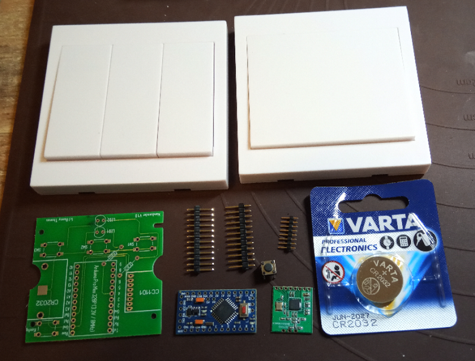
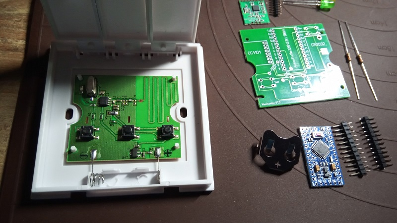
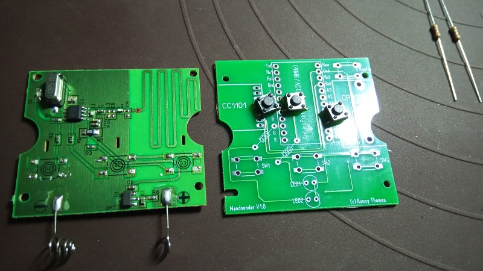
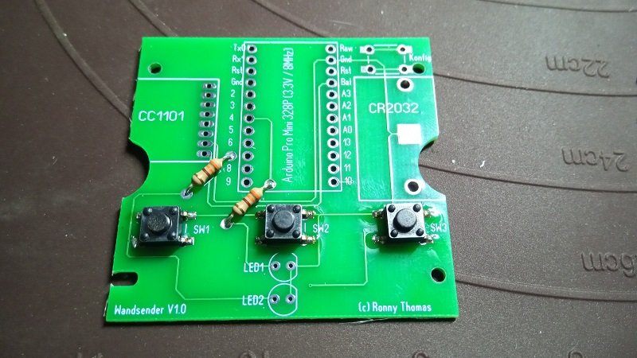
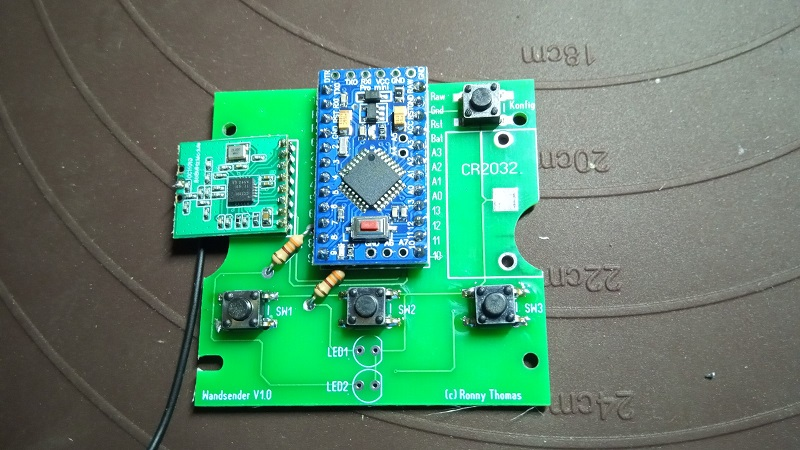
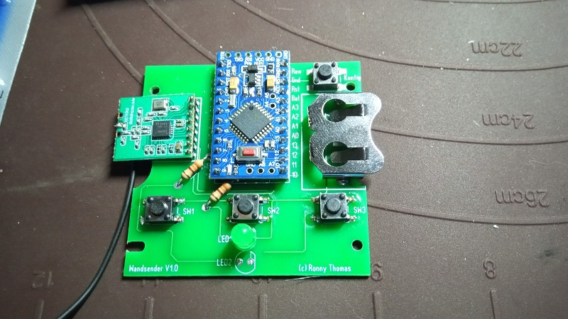
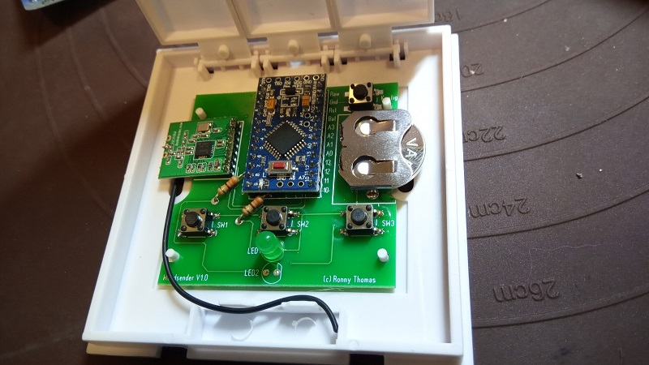
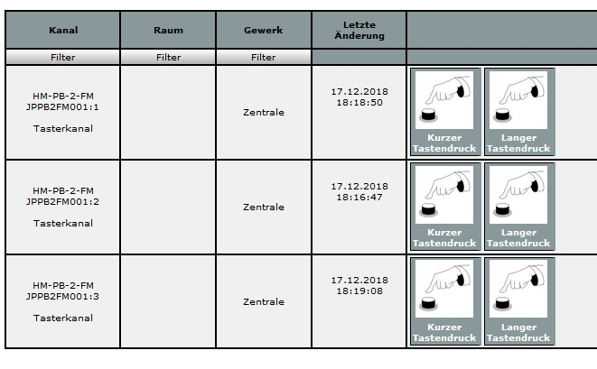

# Wandsender 1- / 3- fach - Homematic 868Mhz
## benötigte Hardware
 * 1x Funk Wandsender Licht Wandschalter 433MHZ für RF Empfänger Fernbedienung [Ebay](https://www.ebay.de/itm/Funk-Wandsender-Licht-Wandschalter-433MHZ-für-RF-Empfänger-Fernbedienung-3-Model/173226547355)
 * 1x Arduino Pro Mini **ATmega328P (3.3V/8MHz)**
 * 1x CC1101 Funkmodul **(868 MHz)**
 * 1x FTDI Adapter (wird nur zum Flashen benötigt)
 * 1x Taster 6*6
 * 1x Batteriehalter print für CR2032 **Reichelt KZH 20P**
 * 1x Batterie CR2032

Optional die LEDS **Verringert die Batterielaufzeit**
* 2x Widerstand 330 Ohm
* 2x LED 3mm

[Kontakt via Facebook](https://www.facebook.com/ronny.thomas.83)

[Software](https://github.com/ronnythomas/Wandsender/blob/master/Data/hm-pb-3-fm.ino)

LEDS und Widerstände können weg gelassen werden!

Batteriehalter Anpassen

